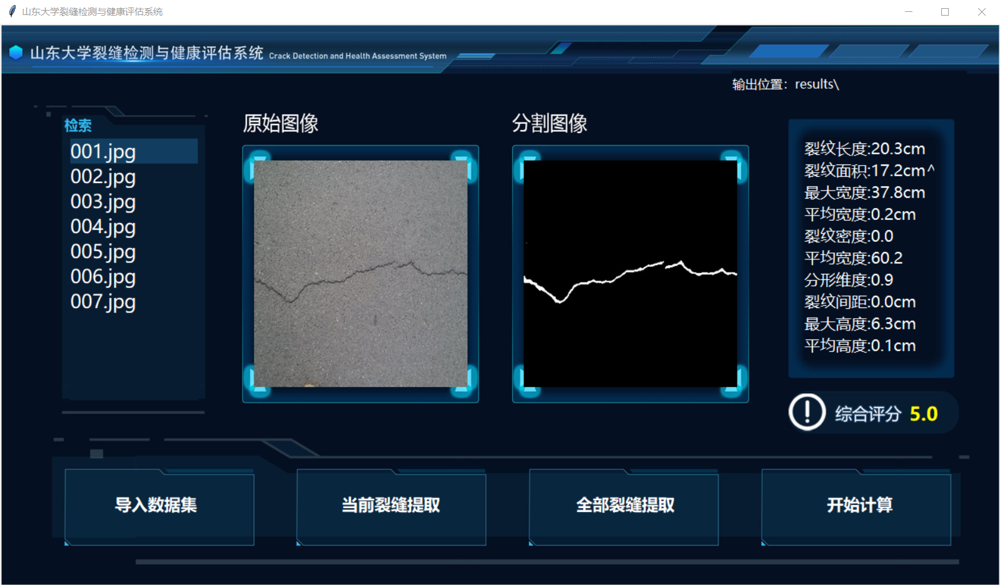
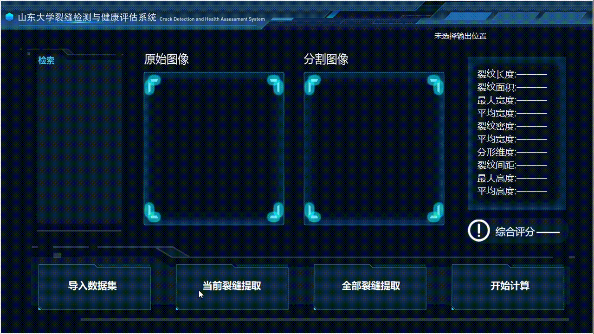

# 山东大学裂缝检测与健康评估系统

 <!-- 替换为你的界面截图路径 -->

本项目是一个基于深度学习的裂缝检测与结构健康评估系统，结合图形界面实现以下功能：
- 裂缝图像批量导入与管理
- 基于UNet的裂缝特征提取
- 多维度的裂缝量化分析
- 结构健康智能评估

## 功能特性

✅ 可视化操作界面  
✅ 支持批量图像处理  
✅ 提供21项裂缝量化指标  
✅ 智能健康评分系统  
✅ 结果对比可视化  
✅ 支持Windows/Linux平台

## 快速开始

### 环境要求
- Python 3.8+
- CUDA 11.3+ (推荐GPU运行)
- PyTorch 1.12+

### 安装步骤
1. 克隆仓库
```bash
git clone https://github.com/yourusername/crack-detection-system.git
cd crack-detection-system
```

2. 安装依赖
```bash
pip install -r requirements.txt
```


### 使用说明
1. 启动程序
```bash
python ui-main.py
```

2. 界面操作流程：
   - 点击"导入数据集"选择图像文件夹
   - 选择图片进行单张检测或批量处理
   - 查看检测结果与健康评分
   - 点击图片查看大图对比


## 示例演示

 <!-- 替换为你的GIF路径 -->

## 常见问题

Q: 如何提高检测精度？  
A: 建议：
1. 使用更高分辨率的图像
2. 增加训练数据量
3. 调整模型超参数

Q: 非GPU环境能否运行？  
A: 可以，但需要修改代码中的`.cuda()`调用


---

**研究团队**：山东大学控制科学与工程学院裂缝检测与智能评估课题组

**版本更新**：2025.01.24